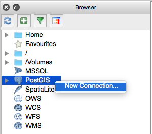
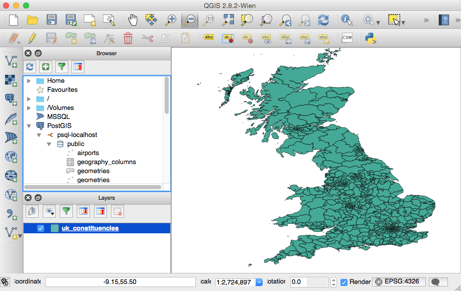

# D3 Maps

The first part of this tutorial follows Mike Bostock's excellent [Let's make a map](http://bost.ocks.org/mike/map/) tutorial.

## Considerations

We want:

- a map which loads fast (**vector map**)
- map data to be stored on the server (instead of being dependent on an external service like Google Maps etc)

## Initial Setup

Install **GDAL**: Download your OS specific version from [here](http://trac.osgeo.org/gdal/wiki/DownloadingGdalBinaries).

> **Note**: On **Federa** execute `sudo yum install gdal.x86_64`. On **Mac OS X** you can use **Homebrew** to install GDAL: `brew install gdal`

Install **NodeJS**.

Install **TopoJSON** via the Node Package Manager:

```
$ sudo npm install -g topojson
```

Verify installation:

```
$ which ogr2ogr
/usr/local/bin/ogr2ogr
$ which topojson
/usr/local/bin/topojson
```


Converting Shapefiles to GeoJSON to TopoJSON

[TopoJSON](https://github.com/mbostock/topojson/wiki) (developed by Mike Bostock) allows us to minify GeoJSON files.

Download these files:

- [Admin 0 - Details - map subunits](http://www.naturalearthdata.com/http//www.naturalearthdata.com/download/10m/cultural/ne_10m_admin_0_map_subunits.zip)
- [Populated Places](http://www.naturalearthdata.com/http//www.naturalearthdata.com/download/10m/cultural/ne_10m_populated_places.zip)

Extract these zip files and then run the commands inside the extracted folders (otherwise you will get an error):

Run the next command inside the `ne_10m_admin_0_map_subunits` to extract the countery shapes for Great Britain and Ireland:

```
ogr2ogr
  -f GeoJSON \
  -where "ADM0_A3 IN ('GBR', 'IRL')" \
  subunits.json \
  ne_10m_admin_0_map_subunits.shp
```

Run the next command inside the `ne_10m_populated_places` folder to extract the major cities:

```
ogr2ogr \
  -f GeoJSON \
  -where "ISO_A2 = 'GB' AND SCALERANK < 8" \
  places.json \
  ne_10m_populated_places.shp
```

Copy both output files (`subunits.json` and `places.json`) into a dedicated directory and merge them with following command:

```
topojson \
  -o uk.json \
  --id-property SU_A3 \
  --properties name=NAME \
  -- \
  subunits.json \
  places.json
```


http://www.ordnancesurvey.co.uk/business-and-government/products/boundary-line.html

http://data.gov.uk/dataset/boundary-line

https://github.com/cmgiven/open-election-map

http://www.qgis.org/en/site/

http://geohackers.in/tag/topojson/

http://edina.ac.uk - free topographic data

[Geographic information system](https://en.wikipedia.org/wiki/Geographic_information_system)
[Spatial Data Formats 101](http://geohackers.in/2013/11/spatial-data-formats-101)

[Github can rendery GeoJSON files](https://help.github.com/articles/mapping-geojson-files-on-github/)

- [Mastering QGIS](https://www.packtpub.com/application-development/mastering-qgis)
- [Learning QGIS - Second Edition](https://www.packtpub.com/application-development/learning-qgis-second-edition)
- [Learning QGIS 2.0](https://www.packtpub.com/application-development/learning-qgis-20): older version of prev book
- [QGIS 2 Cookbook](https://www.packtpub.com/hardware-and-creative/qgis-2-cookbook)
- [Building Mapping Applications with QGIS](https://www.packtpub.com/application-development/building-mapping-applications-qgis)
- [Geospatial Analysis](http://www.amazon.co.uk/Geospatial-Analysis-comprehensive-Michael-Smith-ebook/dp/B006MN9M58/ref=sr_1_1?ie=UTF8&qid=1431158694&sr=8-1&keywords=Geospatial+Analysis)

Election data:
http://data.london.gov.uk/dataset/general-election-results-2015

> **Shapefile**: Shapefiles can store all the commonly used spatial geometries (points, lines, polygons) along with the attributes to describe these features. Unlike other vector formats, a shapefile comes as a set of three or more files – the mandatory .shp, .shx, .dbf and the optional .prj file The .shp file holds the actual geometries, the .shx is an index which allows you to ‘seek’ the features in the shapefile, the .dbf file stores the attributes and the .prj file specifies the projection the geometries are stored in. ([Source](http://geohackers.in/2013/11/spatial-data-formats-101/))

If shapefiles do not sound familiar to you, chances are you really would like to understand what to do with them. If you try opening this kind of file with a text editor, you will realized that this is a binary file type. So we have to find a program/app which can handle shapefiles. There are two **GIS** open source projects which I came across: 

- [QGIS](http://www.qgis.org/en/site/)
- [GRASS](http://grass.osgeo.org)

We will be using QGIS. Pay attention to [install instructions](http://www.qgis.org/en/site/forusers/alldownloads.html#linux). On Fedora, all I had to do was to install the client tools like so:

```
$ sudo yum update
$ sudo yum install qgis qgis-python 
```

The **QGIS Desktop** app will allow us to visualize the shapefile and manipulate it using the GUI, which provides instant feedback - in a nutshell: It will allow spatial geo newbies like us to work more efficiently.

Open the **QGIS Desktop** app. 

Right click on our map layer and choose **Filter**. In the **Query Builder** look for `ADM0_A3` from **Fields** and double click on it, which will populate the **Filter expression** box at the bottom. Complete the expression so that it looks like the one shown below:

```
"ADM0_A3"  IN  ('GBR', 'IRL')
```

Click **OK** and the map should show only the UK and Ireland now.

Next click on the **Add Vector Layer** and choose the populated places shape file. In the **Layers** panel right click on the populated places layer and choose **Filter**. Set the expression to:

```
ISO_A2 = 'GB' AND SCALERANK < 8
```

We can also add some labels if we wanted to: Right click on the populated places layer and choose **Properties** and then **Labels**. Tick **Label this layer with** and choose `Name`. Below this option you'll find some formatting options: Choose **Buffer** and tick **Draw text buffer**. Your map should look like this now:


> **Note**: You can open **GeoJSON** as well as **TopoJSON** files with **QGIS**. When opening **TopoJSON** files, you will be asked to specify the coordinate reference system - just accept the defaults and it will work.

So that's enough playing around with shapefiles for now. Let's focus on the task at hand. 

## Creating the Election Map

### Acquiring the Shapefile

The [Office of National Statistics website](http://www.ons.gov.uk/ons/guide-method/geography/beginner-s-guide/electoral/westminster-parliamentary-constituencies/index.html) points to [this page](https://geoportal.statistics.gov.uk/geoportal/catalog/main/home.page). Choose Download Products > Boundaries. Here we have the option to download [Boundaries : Westminster\_parliamentary\_constituencies\_(GB)\_2013_Boundaries\_(Full_Extent).zip](https://geoportal.statistics.gov.uk/Docs/Boundaries/Westminster_parliamentary_constituencies_(GB)_2013_Boundaries_(Full_Extent).zip) - but the simplified version will do as well. Unzip the file and load the shapefile into **QGIS** to check that this is map contains what we are looking for. Indeed it does! Only Northern Ireland is missing - but we ignore this problem for this exercise as we only have limited time.

### Conversion to Standard Coordinate System

The shape file from the Office of National Statistics uses the English ??? coordinate system. We have to convert it to the **ESPG:4326** standard coordinate system in order to be able to use it with D3. Thanks to Rob Fry, who gave a talk at the D3 meetup in London, I know how to convert the shape file to the required coordinate system now:

Changing just the coordinate system:

```
ogr2ogr \
-t_srs EPSG:4326 \
constituencies.shp \
PCON_DEC_2013_GB_BGC.shp 
```

Changing just the coordinate system and output to GeoJSON:

```
ogr2ogr \
-t_srs EPSG:4326 \
-f GeoJSON \
constituencies.json \
PCON_DEC_2013_GB_BGC.shp 
```

EPSG:4326  is target coordinate system, which happens to be as well the standard coordinate system for the Google Maps KML format.

```
topojson \
      --id-property PCON13CDO \
      --properties name=PCON13NM \
      -o constituencies.topo.json \
      constituencies.json
```

Open: Figure out how to show the coordinate system specified in the shape file.    

Some notes on the conversion from GeoJSON to TopoJSON:

Let's inspect the GeoJSON file: As it is quite large (~20MB), use a sensitive method of opening the file, like the `head` command on the terminal. Or if you have enough resources available on your workstation, open up the file in a performant text editor like **Sublime Text**. 

```json
{ "type": "Feature", "properties": { "PCON13CD": "E14000530", "PCON13CDO": "A01", "PCON13NM": "Aldershot" }, "geometry": { "type": "Polygon", "coordinates": [ [ [ 483524.099999999627471, 150221.900000000372529 ], ... },
```

We are primarily interested in the `PCON13CDO` property, which is the constituency code: We defined this one as a key (`id-property`) in the `topojson` command. And we also want the human readable name of the constituency, which is stored as the value of the `PCON13NM`. (The meaning of the property names is listed in the `Product Specification*` document). Here again the command:

```
topojson \
  --id-property PCON13CDO \
  --properties name=PCON13NM \
  -o constituencies.topo.json \
  constituencies.json
```


Try to load this file into **QGIS** and enable the labels (using the name property).

### Creating the D3 Map

... create `index.html`

We have to tell D3 which data to use. Looking at our topojon file, the data points would come from `object.constituencies`:

```
{"type":"Topology","objects":{"constituencies":{"type":"GeometryCollection","geometries":[{
```

With this knowledge we can start writing our D3 code:

```javascript
d3.json("constituenciestopo.json", function(error, uk) {
    if (error) return console.error(error);
    svg.append("path")
        // adjust topology reference
        .datum(topojson.feature(uk, uk.objects.constituencies))
      .attr("d", d3.geo.path().projection(d3.geo.mercator()));
});
```


To test the HTML page we need a webserver as there are restrictions loading JSON files from the local file system. If you have NodeJS installed you can install `http-server` via **npm**:

```
sudo npm install http-server -g
```

Now run this in the same directory as the HTML file is located in:

```
http-server -p 8008
```

Open `http://0.0.0.0:8008` in your favourite web browser.

Alternatively you can also use the Python http server:

```
python -m SimpleHTTPServer
```

> **Note**: If **Chrome** shows this error in the JS console ` Uncaught TypeError: Cannot read property 'type' of undefined` then you are referencing an object that doesn't exist in your topology. ([Source](http://stackoverflow.com/questions/15509493/topojson-js187-uncaught-typeerror-cannot-read-property-type-of-undefined)). **Firefox** displayed the same error as: `TypeError: t is undefined`.

### Adding Colors?

We'd like to color constituencies in a specific color. Let's start in a simple fashion and just try to assign a static color to a given constituency.

To make this happen, we have to change the way the map is drawn: We have to create a **polygon** for each constituency and store the value of `id` in a newly created `constituency` property:

```javascript
d3.json("constituencies.topo.json", function(error, topology) {
  // create a polygon for every constituency
  svg.selectAll(".constituency")
    // retrieve the features so that we can access the id
    	.data(topojson.feature(topology, topology.objects.constituencies).features)
    	.enter().append("path")
    	.attr("class", function(d) { return "constituency " + d.id; })
    	.attr("d", path);
});
```

We will highlight a bigger constituency (*Brecon and Radnorshire*), so that the effect is easy to spot. Amend the `style` section as follows:

```html
<style>
.constituency.W28 { fill: red; }
</style>
```


[FILEREF](constituencies-map-3-higlight.html)

### Dynamic Color Coding

In general we have two options to combine the election data with the map data: 

- On the fly or 
- joining the data upfront, so that the election data is part of the shape file or the equivalent JSON files (e.g. via Kettle transformation)

# Problems

## My map looks completely messed up in the web browser

In my case the map looked like a modern piece of art - far from the map I wanted to have. I was first wondering if the topojson file got corrupted, but it displayed nicely in QGIS and 
After a long search a came across [this Stackoverflow issue](https://stackoverflow.com/questions/29009566/d3-map-with-topojson-doesnt-render-properly/30165624#30165624), stating the issue is: "scale and translate properties (inside transform property) were way off, and that caused these wrong images for my map".

> **Hint**: Nelson Sousa suggests removing the transform (translate and scale) bits from the topojson files. All you want to have is the contours and you can do the scaling in d3 any ways.

To look at:

- pdi ESRI? Shapefile input step
- webservice to convert shapefile to geojson http://ogre.adc4gis.com/
- dynamic simplification: when you zoom in, that more detail is loaded

file type | description
------|-----
shp | Shapefile, which contains the contours
dbf | Database file, which contains the attributes


# Simplifying the topography file

## Best approach

1. Upload it to [Mapshaper](http://mapshaper.org) and use their simplify function. Make sure you click the **Repair** feature if available. Download as GeoJSON so that we can still define the id etc. (See if you can do a similar thing in QGIS).
2. Use the topojson command to convert GeoJSON file.
3. Remove transform (scale, translate) at the end of the file.

QGIS: Vector > Geometry Tools > Simplify Geometries: Hm, not really great results

## Alternative

The topojson file is still fairly large, let's try simplifying it further. The excellent article [Spatial data on a diet: tips for file size reduction using TopoJSON](http://zevross.com/blog/2014/04/22/spatial-data-on-a-diet-tips-for-file-size-reduction-using-topojson/) by Zav Ross outlines a few possibilties to slim down the file:

```
topojson \
  --id-property PCON13CDO \
  --properties name=PCON13NM \
  -q 5000 \
  -s 1e-8 \
  -o constituencies.topo.json \
  constituencies.json
```

If we check the file size now, we see that our topojson file only takes up only 1.4MB now.

```
topojson \
  --id-property PCON13CDO \
  --properties name=PCON13NM \
  -q 5000 \
  -s 1e-8 \
  -o constituencies.topo.json \
  constituencies.json
```

Always check the output. It is very easy to "destroy" the map by using too much simplification - always properly check the output.


-----------

## Shapefiles and Projection

OPEN

Each shape file comes with a `*.prj` file.

[Source](http://workshops.boundlessgeo.com/postgis-intro/loading_data.html):

If you open up the nyc_neighborhoods.prj file from the data directory, you’ll see the same projection definition.

A common problem for people getting started with PostGIS is figuring out what SRID number to use for their data. All they have is a .prj file. But how do humans translate a .prj file into the correct SRID number?

The easy answer is to use a computer. Plug the contents of the .prj file into http://prj2epsg.org. This will give you the number (or a list of numbers) that most closely match your projection definition. There aren’t numbers for every map projection in the world, but most common ones are contained within the prj2epsg database of standard numbers.

# Using a GIS Database

A few databases offer GIS support - one of the most popular is **PostgreSQL**, for which an extension called **PostGIS** is available - which we will use. Installing PostGIS is fairly straight forward, so I will not cover it here.

## Import Shapefile to PostGIS

- [Source](http://workshops.boundlessgeo.com/postgis-intro/loading_data.html)
- [Specifications for coordinate reference systems]
(http://spatialreference.org/ref/epsg/26918/)
- [StackExchange](http://gis.stackexchange.com/questions/34506/how-to-import-data-with-srid-4269-to-geography-type)

1. **Convert the projection info into standard ESPG codes**: To get the correct spatial reference identifier (**SRID**) put contents of the `.prj` file [this online Prj2EPSG converter](into http://prj2epsg.org). It turns out that our shape file has an **SRID** of `27700` (which is based on the `British_National_Grid`)

We could import our shape file like this:

```
shp2pgsql -c -D -s 27700 -i -I PCON_DEC_2013_GB_BGC.shp public.uk_constituencies > uk_constituencies.sql
```

But ideally we also want to convert it straight away to the required target coordinate system:

```
shp2pgsql -c -s 27700:4326 -i -I PCON_DEC_2013_GB_BGC.shp public.uk_constituencies > uk_constituencies.sql
```

Let's now run this script:

```
psql -hlocalhost -dgeo -Upostgres < uk_constituencies.sql
```

Check with your SQL client that the table exists, e.g.:

```sql
SELECT * FROM uk_constituencies LIMIT 20;
```

## Viewing the Map ##

Download the most popular open source GIS app **QGIS** from [here](http://qgis.org). Installation is fairly straight forward, so I will not cover the details here. 

Open the app. In the **Browser** panel right click on **PostGIS** and choose **New Connection**:

Provide the connection details. Once connected, expand the node and double click on our **uk_constituencies** table, which will add it to the **Layers** panel and herewith display the map in the main window:



I guess you are with me when I am saying that saying the geo data visually is a far better experience!



The basics of **QGIS** are quite easy to learn. If you are looking for a good intro book on QGIS, I can recommend *Getting started with GIS - Using QGIS* (available on Amazon), which provides both an introduction to GIS and QGIS - so this really ideal for beginners.

## Adding your data

Our map looks rather uninteresting - let's add some data: Download the **UK general election data 2015 - collated results (XLS)** from [here](http://www.electoralcommission.org.uk/our-work/our-research/electoral-data)


Load data into psql ...


Categorize Map in QGIS ...


## Simplify Geometry

- [ST_Simplify](http://www.bostongis.com/postgis_simplify.snippet)
- [ST_SimplifyPreserveTopology](http://postgis.net/docs/ST_SimplifyPreserveTopology.html)

For our web map we require a small file, hence we will simplify the polygons. **PostGIS** offers a convenient function to do just this. Before getting started, you have to install the GEOS module ??

OPEN

```
brew install geos
```

In my case it was already installed. 

```sql
SELECT ST_SIMPLIFY(geom) FROM uk_constituencies LIMIT 20;
```

Or even better use the `ST_SimplifyPreserveTopology` function:

```sql
SELECT ST_SimplifyPreserveTopology(geom) FROM uk_constituencies LIMIT 20;
```

## Export as TopoJSON

http://postgis.net/docs/AsTopoJSON.html

also export as SVG: ST_AsSVG(geometry)