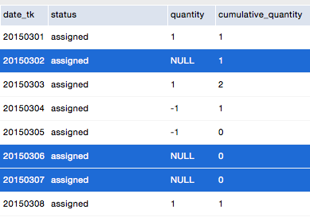
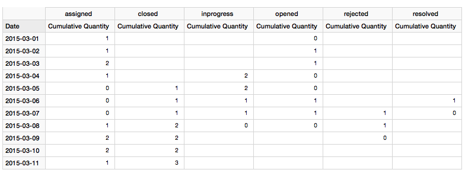

## Creating an event ? STATUS ? table

On a recent project the task was to store any event in a workflow on Hadoop. As most of you will know, Hadoop was not originally designed for updates, hence we had to resort to an alternative strategy - which was suggested by Nelson Sousa: The idea is to **negate** the last event once a new event arrives. The original event has a count of `1` whereas the negating/closing record of the same event has a count of `-1`. When you sum the records, the result will be `0`. 

Another requirement was that we can record any event: The workflow is not necessarily sequential. Items can jump back and forth several times. This means that **Kimball's accumulative snapshot** approach cannot be applied. 

For this tutorial we will use a highly simplified sample dataset based on Jira cases. 

Cutover dataset (historic data):

```
date_time,issue_id,status,user
2015-03-01 12:33:00,333,opened,Sam
2015-03-01 13:22:00,333,assigned,Tony
2015-03-04 09:01:00,333,inprogress,Tony
2015-03-06 17:23:21,333,resolved,Tony
2015-03-07 10:23:00,333,rejected,Sam
2015-03-09 08:31:00,333,assigned,Larry
2015-03-11 15:28:00,333,closed,Larry
2015-03-02 09:34:00,345,opened,Tim
2015-03-03 13:34:00,345,assigned,Sam
2015-03-04 11:23:00,345,inprogress,Jim
2015-03-05 15:21:00,345,closed,Tim
2015-03-03 10:23:00,377,opened,Larry
2015-03-04 18:45:00,377,assigned,Sam
```

First delta dataset:

```
date,issue_id,status,user
2015-03-05 16:23:00,377,inprogress,Sam
2015-03-08 17:45:00,377,closed,Sam
2015-03-06 19:01:01,288,opened,Larry
2015-03-08 11:43:00,288,assigned,Jim
```

The basic algorithm will create a closing record for each event once a new one arrives. The closing record's date will be the same as the one of the next event:


...

## Creating the Snapshot

In order to be able to analyse the amount of times in a certain state on a given day, we have to create a snapshot table. The setup is similar to the one of bank statement: There is a balance and the difference to the previous balance is shown (in form of transactions). Hence there is no need to recalculate everything since the opening of bank account.

> **Filling the gaps**: The important point to consider is that for a daily snapshot we have to create daily records even if there is no measure available for this particular day and the combination of any other dimensions. The fillings are highlighted in the below screenshot in blue:



An simple strategy to create these **fillings** is to calculate the difference in amount of days between the current record and the next record and subtract minus 1. Then you can use this number to clone the current record. Care must be taken to set any measures to `NULL` in the **clones** (apart from the cumulative measures).

## Creating the Cube Definition

Writing the **Mondrian** OLAP Schema for our `fact_events` and `fact_events_snapshot` tables is quite straight forward: We will create one cube for **Events** and one for **Events On hand**. For the first cube we will create a derived dimension called **Flow** in order to better show the in and out movement:

```xml
[Add Mondrian Schema]
```

## Creating a Few Sample Reports

A very simple report will show the amount of issues added and removed from a certain status on a given day:


The next report is a bit similar, but we set following filters:

- Show all **Status**es except `Opened`
- Show all statuses for **Flow** `in` only


Our sample dataset is extremely small, but in real world scenarios you can take the output of the above query for just one day and display it in a **Sankey** or **Alluvial Diagram**. Here is an example based around our use case, just with a  bit more data:


The above diagram was quickly created with [RAW](http://app.raw.densitydesign.org) - a good way to prototype this type of chart. You can later on implement this kind of chart in a **Pentaho CDE** dashboard.

And finally we want to understand how many items there are each day in a given status, which can be answered by our **Events Snapshot** cube:



`2015-03-01` shows `0` items as in **Status** `opened`. The reason for this is that the snapshot represents the state at the end of the day: One item was opened on `2015-03-01` and assigned on the same day, hence our snapshot shows `0` for `opened` and `1` for `assigned`. 

----

## Creating a Snapshot Table

### Basic Strategy

The approach below assumes that all data is available for each stored day.

1. From the **existing snapshot data**, get the records for the last date as we have to have access to the cumulative quantity.
2. Get the **new data**: The delta is max snapshot date to max new data date. Do not use the current date or yesterday as you might still get data for it later on.
3. From the **new data** we require the **maximum date** (across any combination of dims) because we have to create records for any dim combinations until this date in case there is no measure for them. For some record we might have measures for category X until the most recent date but for category Y we might only have data until 2 days earlier. So even though no changes happened for category Y, we still have to create records for it.

It is worth noting that if there is a certain category (combination of dims) in the existing snapshot data but no corresponding new data, we have to keep on creating records for them in the snapshot table for each day (create clones).

For all categories (combinations of dims) that we create clones for for each day, the cumulative sum will be the same an the standard sum/quantity will be 0. 

> **In a nutshell**: If there are no new measures for a given day, a snapshot table still has to show a record (if that combination of dims showed up in the past).


The example above (shown in the screenshot) illustrates some of the considerations we have to take:

- **Gaps in data** (rows with green font)
	- No data between 31 May and Jun 2 (rows with yellow background colour)
	- No data between 3rd and 6th June (most recent date in the example) (rows with red background colour): For other categories we have data up to the 7th June, so we have to create an extra record for this category / combination of dimensions.

Max date can just be a parameter as well or we can use a cartesian join later on to add it, so it doesn't have to be necessarily in the main input data.

### Dealing With Late Arriving Data

In the case of Hadoop, we cannot just update existing records in case we have late arriving data (and usually it is not a good idea to update records in a any case unless it is a accumulating snapshot).


In the example shown above, we receive a record on the 8th of Jun for the 1st of Jun. Snapshot data is already available until the 7th of Jun. As we cannot update the existing records, we just insert new records (highlighted in yellow) for evert day since the 1st of Jun to correct the existing records.