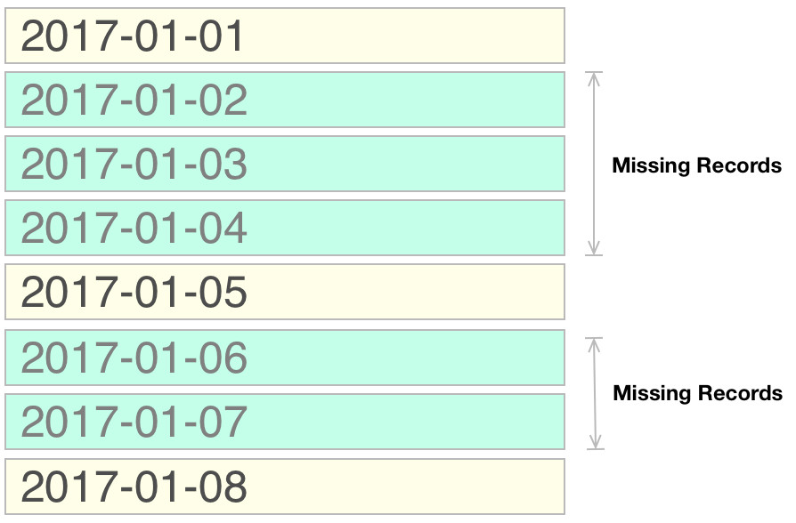

# Introduction

I have covered the concept of creating a **snapshot** in the **Big Data** world in various blog post - but the solution was never ideal. This was mainly due to the constrains on the used system. So far the most problematic point has been that none of the tools we used were **event time aware**, which resulted in us haven to create additional records for time periods that were missing. And in real world scenario this process turns in to a Big Data generation monster. And really this should be a lot easier!

Along comes stream processing - these days really matured with the current top contenders Apache Flink and Apache Spark (structured streaming to be precise) both supporting event time. If take a step back for a moment and look a bit outside the Big Data specialised timeseries databases have been around for some time.

Example: [TimescaleDB](http://docs.timescale.com/latest/api#select) with specific function taken from their docu

```sql
-- Information about each 15-min period for each location
-- over the past 3 hours, ordered by time and temperature
SELECT time_bucket('15 minutes', time) AS fifteen_min,
    location, COUNT(*),
    MAX(temperature) AS max_temp,
    MAX(humidity) AS max_hum
  FROM conditions
  WHERE time > NOW() - interval '3 hours'
  GROUP BY fifteen_min, location
  ORDER BY fifteen_min DESC, max_temp DESC;


-- How many distinct locations with air conditioning
-- have reported data in the past day
SELECT COUNT(DISTINCT location) FROM conditions
  JOIN locations
    ON conditions.location = locations.location
  WHERE locations.air_conditioning = True
    AND time > NOW() - interval '1 day'
```

Use the right tool for the right job - right? Well as long as it is available. When the Big Data world was brand new, these tools didn’t exist for most Big Data stacks or the were simply not mature enough. Not that we have these tools at our disposal, let’s have a look at one of them.

## TimescaleDB

- [Website](https://docs.timescale.com/latest/main)
- [Official Docu](https://docs.timescale.com/latest/api)
- [GitHub](https://github.com/timescale/timescaledb)

**TimescaleDB** uses **PostgreSQL** under the hood with enhanced scale-out support to create a cluster.

Let's run TimescaleDB in a Docker container.

```bash
# start docker daemon if not already running
sudo service docker status
sudo service docker start
# pull image
sudo docker pull timescale/timescaledb
```

**TimescaleDB** unfortunately does not seem to provide a feature to create the missing records.

```sql
CREATE database tutorial;
-- Connect to the database
\c tutorial;
-- Extend the database with TimescaleDB
CREATE EXTENSION IF NOT EXISTS timescaledb CASCADE;

CREATE TABLE account (
  "time" TIMESTAMPTZ NOT NULL
  , "user" VARCHAR(20)
  , "amount" DECIMAL
)
;

-- This creates a hypertable that is partitioned by time
--   using the values in the `time` column.
SELECT create_hypertable('conditions', 'time');

INSERT INTO account (time, user, amount)
VALUES 
  ('2017-01-01 12:13:24', 'Ralph', 70.0)
  , ('2017-01-05 19:19:44', 'Ralph', -20.0)
  , ('2017-01-08 02:11:24', 'Ralph', 80.0)
RETURNING *
;
```

## InfluxDB

- [Website](https://www.influxdata.com/)
- [Community Forum](https://community.influxdata.com/)
- Other intersting projects: 
  - Telegraf: [Info](https://www.influxdata.com/time-series-platform/telegraf/), [Github](https://github.com/influxdata/telegraf)

We will use the [Docker container](https://hub.docker.com/_/influxdb/) - if you prefer to download the DB and install it locally, instructions are [here](https://portal.influxdata.com/downloads#influxdb) and [here](https://docs.influxdata.com/influxdb/v1.3/introduction/installation/):

```bash
# start docker daemon if not already running
sudo service docker status
sudo service docker start
# pull image
# sudo docker pull timescale/timescaledb
sudo docker pull influxdb
# run container - change port mapping if required to not conflict with local psql instance
# here I am mapping local port 8086 to container port 8086
# and the local /tmp dir to the one in the container to store the data
sudo docker run -p 8086:8086 \
      -v /tmp:/var/lib/influxdb \
      influxdb
# access psql command line on the container
docker run --name=influxdb -d -p 8086:8086 influxdb
```

Local install route on Fedora:

```
wget https://dl.influxdata.com/influxdb/releases/influxdb-1.3.7.x86_64.rpm
sudo dnf localinstall influxdb-1.3.7.x86_64.rpm
sudo systemctl start influxdb
# see config details
influxd config
# connect to the client
influx -precision rfc3339
```

> **Note**: `precision rfc3339` tells **InfluxDB** to return timestamps in RFC3339 format (`YYYY-MM-DDTHH:MM:SS.nnnnnnnnnZ`).

Read the **official docu** on how to use [the command line client](https://docs.influxdata.com/influxdb/v1.3/tools/shell/).

> **Note**: **InfluxDB** uses a SQL-like language - not quite the SQL what you might be familiar with.

```sql
CREATE database tutorial;
-- Connect to the database
USE tutorial;
```

**Inserting data** into a table is a bit different from other databases that you might be familiar with (see also [here](https://docs.influxdata.com/influxdb/v1.3/introduction/getting_started/) and [here](https://docs.influxdata.com/influxdb/v1.3/write_protocols/line_protocol_reference/)):

In a standard database we would use this:

```sql
INSERT INTO account (time, user, amount)
VALUES 
  ('2017-01-01 12:13:24', 'Ralph', 70.0)
  , ('2017-01-05 19:19:44', 'Ralph', -20.0)
  , ('2017-01-08 02:11:24', 'Ralph', 80.0)
;
```

For InfluxDB we have to translate this to:

```sql
# since we use unix timestamp in seconds we have
# to switch to precision in seconds
precision s
INSERT events,user=Ralph amount=70.0 1483272804
INSERT events,user=Ralph amount=-20.0 1483643984
INSERT events,user=Ralph amount=-80.0 1483841484
SELECT * FROM events
name: events
time       amount user
----       ------ ----
1483272804 70     Ralph
1483643984 -20    Ralph
1483841484 -80    Ralph

# switching back to readable date format
precision rfc3339
SELECT * FROM events
name: events
time                 amount user
----                 ------ ----
2017-01-01T12:13:24Z 70     Ralph
2017-01-05T19:19:44Z -20    Ralph
2017-01-08T02:11:24Z -80    Ralph
```

The `INSERT` statement is consists of the **table name** followed by **attributes** (key/values all comma separated), a space and then **measures** (key/values e.g. speed, temperature etc) and finally, separated by space, the unix timestamp value by default in nano second precision (the last one is optional, if not specified, current time will be taken). If you do not want to supply the time value in nanoseconds, use the `precision` setting to change to granularity.

A more complex example is this one:

```
payment,device=mobile,product=Notepad,method=credit billed=33,licenses=3i 1434067467100293230
```

Note: I just used PostgreSQL to quickly return the Unix timestamp like so:

```
SELECT EXTRACT(EPOCH FROM CAST('2017-04-06 02:11:24' AS TIMESTAMP));
```

If you ever have to **drop a table** (do not execute this now), you can run this command:

```sql
DROP MEASUREMENT events
```

Let's create a **daily breakdown** of the figures now. Remember that our problem is that **we do not have records for every day**, which is partially illustrated below. The yellow bars illustrate an existing record, whereas the turquois ones would normally have to exist to return a complete daily resultset (but they do not exist in our case):



**InfluxDB** provides a very useful **time window function** which will create these missing records for us. You can specify for any **duration**, e.g. seconds, days etc. In our example, we want to have **stats for every day**:

```sql
SELECT SUM(amount) FROM events WHERE time >= '2017-01-01' AND time <= '2017-01-10' GROUP BY time(1d)
name: events
time                 sum
----                 ---
2017-01-01T00:00:00Z 70
2017-01-02T00:00:00Z 
2017-01-03T00:00:00Z 
2017-01-04T00:00:00Z 
2017-01-05T00:00:00Z -20
2017-01-06T00:00:00Z 
2017-01-07T00:00:00Z 
2017-01-08T00:00:00Z -80
2017-01-09T00:00:00Z 
2017-01-10T00:00:00Z 
```

As you see, we do have the additional new records to fill the gaps now (where we do not have an original record), however, the measure is empty for these records.

> **Note**: InfluxDB will create the first record for the start date of the **date range constrain** you specified. So let's say you wanted records from the 28th of December, InfluxDB will create records starting from this day in the specified intervals:

```sql
SELECT SUM(amount) FROM events WHERE time >= '2016-12-28' AND time <= '2017-01-10' GROUP BY time(1d)
name: events
time                 sum
----                 ---
2016-12-28T00:00:00Z 
2016-12-29T00:00:00Z 
2016-12-30T00:00:00Z 
2016-12-31T00:00:00Z 
2017-01-01T00:00:00Z 70
2017-01-02T00:00:00Z 
2017-01-03T00:00:00Z 
2017-01-04T00:00:00Z 
2017-01-05T00:00:00Z -20
2017-01-06T00:00:00Z 
2017-01-07T00:00:00Z 
2017-01-08T00:00:00Z -80
2017-01-09T00:00:00Z 
2017-01-10T00:00:00Z 
```

**InfluxDB** provides an interesting function called `fill()` which can provide values for these new records (see [docu](https://docs.influxdata.com/influxdb/v1.3/query_language/data_exploration/#group-by-time-intervals-and-fill)). There are a few different `fill` options available - as an example we pick the previous value:

```sql
SELECT SUM(amount) FROM events WHERE time >= '2017-01-01' AND time <= '2017-01-10' GROUP BY time(1d) fill(previous) 
name: events
time                 sum
----                 ---
2017-01-01T00:00:00Z 70
2017-01-02T00:00:00Z 70
2017-01-03T00:00:00Z 70
2017-01-04T00:00:00Z 70
2017-01-05T00:00:00Z -20
2017-01-06T00:00:00Z -20
2017-01-07T00:00:00Z -20
2017-01-08T00:00:00Z -80
2017-01-09T00:00:00Z -80
2017-01-10T00:00:00Z -80
```

Another interesting option is the `linear` fill:

```sql
SELECT SUM(amount) FROM events WHERE time >= '2017-01-01' AND time <= '2017-01-10' GROUP BY time(1d) fill(linear) 
name: events
time                 sum
----                 ---
2017-01-01T00:00:00Z 70
2017-01-02T00:00:00Z 47.5
2017-01-03T00:00:00Z 25
2017-01-04T00:00:00Z 2.5
2017-01-05T00:00:00Z -20
2017-01-06T00:00:00Z -40
2017-01-07T00:00:00Z -60
2017-01-08T00:00:00Z -80
2017-01-09T00:00:00Z 
2017-01-10T00:00:00Z 
```

What we are after, however, is a **cumulative sum** for our snapshot:

```sql
SELECT CUMULATIVE_SUM(SUM(amount)) FROM events WHERE time >= '2017-01-01' AND time <= '2017-01-10' GROUP BY time(1d) 
name: events
time                 cumulative_sum
----                 --------------
2017-01-01T00:00:00Z 70
2017-01-05T00:00:00Z 50
2017-01-08T00:00:00Z -30
```

As you can see, the generated records (the ones that do not exist in our original input dataset) are gone from this result, which is unfortunate, however, if we change the inner aggregation function to a `COUNT`, they are back again (so this seems to be more like a bug):

```sql
SELECT CUMULATIVE_SUM(COUNT(amount)) FROM events WHERE time >= '2017-01-01' AND time <= '2017-01-10' GROUP BY time(1d) 
name: events
time                 cumulative_sum
----                 --------------
2017-01-01T00:00:00Z 1
2017-01-02T00:00:00Z 1
2017-01-03T00:00:00Z 1
2017-01-04T00:00:00Z 1
2017-01-05T00:00:00Z 2
2017-01-06T00:00:00Z 2
2017-01-07T00:00:00Z 2
2017-01-08T00:00:00Z 3
2017-01-09T00:00:00Z 3
2017-01-10T00:00:00Z 3
```

[Here](https://github.com/influxdata/influxdb/issues/5930) is a compiled list of aggregation request/improvements.
